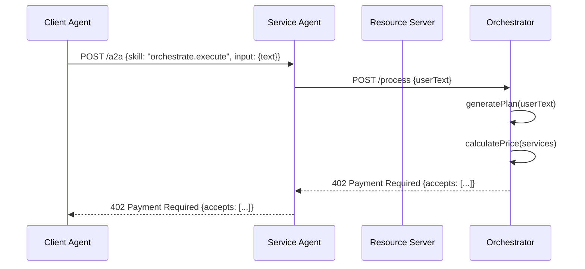
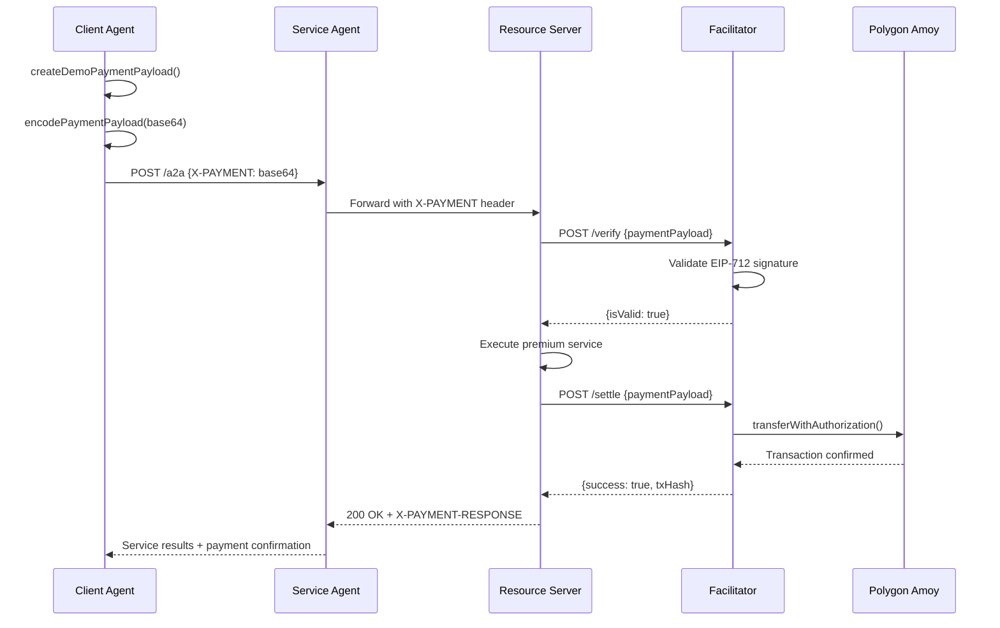

# x402 Protocol Architecture & Framework

## 🎯 Overview

The **x402 Protocol** is a revolutionary **HTTP-native payment standard** that enables seamless digital payments on the internet using the existing `402 Payment Required` status code. This framework demonstrates **Agent-to-Agent (A2A) cooperation** with **blockchain-based payments** settled on **Polygon Amoy testnet**.

> **Core Philosophy**: "1 line of code to accept digital dollars. No fee, 2 second settlement, $0.001 minimum payment."

---

## 🏗️ Architecture Components

### **Core Protocol Stack**

| Layer | Component | Purpose |
|-------|-----------|---------|
| **🌐 HTTP Layer** | Resource Servers | Expose premium endpoints with 402 challenges |
| **🤖 Agent Layer** | Client/Service Agents | Handle A2A communication via JSON-RPC |
| **💰 Payment Layer** | Facilitator | Verify & settle EIP-3009 payments |
| **🔗 Blockchain Layer** | Polygon Amoy | Execute on-chain transactions |

### **Service Ecosystem**

| Service | Port | Description | Capabilities |
|---------|------|-------------|--------------|
| **🎯 Orchestrator** | 5400 | Plan generation & service coordination | Text-to-plan, pricing, execution |
| **🔐 Facilitator** | 5401 | Payment verification & settlement | EIP-3009, transaction broadcasting |
| **⚡ Service Agent** | 5402 | A2A server with JSON-RPC | Message routing, payment forwarding |
| **📱 Client Agent** | 5403 | A2A client with payment handling | EIP-712 signing, retry logic |
| **📰 News Service** | 5404 | Cryptocurrency news aggregation | Sentiment analysis, asset filtering |
| **🌤️ Weather Service** | 5405 | Weather data & forecasts | City-based weather information |
| **📊 OHLCV Service** | 5406 | Price data & market metrics | Historical & real-time data |
| **🎨 NFT Service** | 5407 | NFT analysis & rarity scoring | Trait analysis, rarity calculation |
| **📈 Backtest Service** | 5408 | Trading strategy backtesting | Performance metrics, risk analysis |

---

## 🔄 Protocol Flow

### **Phase 1: Discovery & Challenge**



### **Phase 2: Payment & Settlement**



---

## 🛠️ Technical Implementation

### **Payment Protocol (EIP-3009)**

```typescript
// Payment Requirements Schema
interface PaymentRequirements {
  scheme: "exact"                    // Payment scheme
  network: "polygon-amoy"           // Blockchain network
  maxAmountRequired: string          // Amount in atomic units
  resource: string                   // Protected endpoint URL
  description: string                // Human-readable description
  mimeType: "application/json"      // Response content type
  payTo: string                     // Recipient address
  maxTimeoutSeconds: number         // Request timeout
  asset: string                     // ERC-20 token contract
  extra: {                          // Scheme-specific data
    name: "USDC"
    version: "2"
  }
}
```

### **Agent Communication (JSON-RPC 2.0)**

```typescript
// A2A Message Format
interface A2AMessage {
  jsonrpc: "2.0"
  id: number
  method: "message/send"
  params: {
    skill: string                    // Service identifier
    input: any                       // Request payload
  }
}
```

### **Service Skills**

| Skill | Description | Input Schema | Output Schema |
|-------|-------------|--------------|---------------|
| `premium.summarize` | AI-powered content summarization | `{text: string}` | `{summary: string}` |
| `orchestrate.execute` | Multi-service execution | `{text: string}` | `{results: ServiceResult[]}` |
| `news.fetch` | Cryptocurrency news | `{assets: string[]}` | `{articles: Article[]}` |
| `weather.get` | Weather information | `{city: string}` | `{forecast: WeatherData}` |
| `ohlcv.query` | Price data | `{symbol: string, timeframe: string}` | `{data: OHLCVData[]}` |
| `nft.analyze` | NFT rarity analysis | `{contract: string, tokenId: string}` | `{rarity: number, traits: Trait[]}` |
| `backtest.run` | Strategy backtesting | `{strategy: Strategy}` | `{metrics: BacktestResult}` |

---

## 🚀 Service Architecture

### **Orchestrator Service**
- **Purpose**: Central coordinator for multi-service requests
- **Capabilities**:
  - Natural language processing (Gemini AI)
  - Service discovery & routing
  - Dynamic pricing with bundling discounts
  - Payment requirement generation
  - Service execution coordination

### **Facilitator Service**
- **Purpose**: Payment verification & blockchain settlement
- **Capabilities**:
  - EIP-712 signature validation
  - EIP-3009 transferWithAuthorization
  - Transaction broadcasting
  - Payment confirmation tracking
  - Multi-chain support (Polygon Amoy)

### **Service Agents**
- **Purpose**: Specialized service providers
- **Capabilities**:
  - Domain-specific data processing
  - Payment-gated premium features
  - Real-time data aggregation
  - AI-powered analysis (sentiment, rarity, etc.)

---

## 💡 Key Features

### **🔒 Security**
- **EIP-712 Typed Data**: Cryptographically secure payment signatures
- **Nonce Management**: Prevents replay attacks
- **Timeout Protection**: Configurable request timeouts
- **Signature Validation**: Multi-layer verification

### **⚡ Performance**
- **Parallel Execution**: Services run concurrently
- **Caching**: Optimized data retrieval
- **Bundling Discounts**: Cost optimization for multi-service requests
- **Fast Settlement**: 2-second payment confirmation

### **🌐 Interoperability**
- **HTTP Native**: Works with existing web infrastructure
- **Chain Agnostic**: Supports multiple blockchains
- **Token Agnostic**: Any ERC-20 compatible token
- **RESTful APIs**: Standard HTTP endpoints

### **🎯 User Experience**
- **One-Line Integration**: Minimal code required
- **Automatic Retry**: Smart payment retry logic
- **Error Handling**: Comprehensive error responses
- **Real-time Feedback**: Live payment status updates

---

## 🔧 Development Workflow

### **Local Development**
```bash
# 1. Environment Setup
cp demo/.env.example demo/.env.local
# Configure testnet keys and endpoints

# 2. Install Dependencies
pnpm install

# 3. Start All Services
bash demo/scripts/start-all.sh

# 4. Monitor Logs
tail -f /tmp/client.log
tail -f /tmp/facilitator.log
tail -f /tmp/resource.log
tail -f /tmp/service.log
```

### **Service Development**
```bash
# Individual Service Testing
cd demo/a2a/services/sentiment
python sentiment.py

# Service Integration Testing
bash demo/test-simple.sh
bash demo/test-orchestrator.sh
```

---

## 📊 Monitoring & Observability

### **Health Checks**
- **Orchestrator**: `GET /healthz` - Service status & dependencies
- **Facilitator**: `GET /supported` - Supported schemes & networks
- **Services**: Individual health endpoints

### **Logging**
- **Structured Logs**: JSON format for easy parsing
- **Request Tracing**: End-to-end request tracking
- **Payment Events**: Transaction lifecycle logging
- **Error Tracking**: Comprehensive error reporting

### **Metrics**
- **Payment Success Rate**: Transaction completion metrics
- **Service Response Time**: Performance monitoring
- **Error Rates**: Service reliability tracking
- **Usage Patterns**: Service utilization analytics

---

## 🔮 Future Roadmap

### **Phase 1: Core Protocol** ✅
- [x] HTTP 402 payment challenges
- [x] EIP-3009 payment settlement
- [x] Agent-to-agent communication
- [x] Multi-service orchestration

### **Phase 2: Ecosystem Expansion** 🚧
- [ ] Additional blockchain networks
- [ ] More payment schemes (upto, subscription)
- [ ] Enhanced service discovery
- [ ] Mobile SDK integration

### **Phase 3: Advanced Features** 📋
- [ ] Cross-chain payments
- [ ] Subscription billing
- [ ] Dynamic pricing
- [ ] AI-powered service optimization

---

## 🤝 Contributing

### **Adding New Services**
1. Create service directory in `demo/a2a/services/`
2. Implement payment-gated endpoint
3. Add service to orchestrator registry
4. Update documentation

### **Adding New Payment Schemes**
1. Define scheme specification in `specs/schemes/`
2. Implement facilitator verification
3. Add client-side payload generation
4. Update protocol documentation

### **Testing**
- **Unit Tests**: Individual component testing
- **Integration Tests**: End-to-end workflow testing
- **E2E Tests**: Full protocol validation
- **Security Tests**: Payment security verification

---

## 📚 Resources

- **Protocol Specification**: [x402.org](https://x402.org)
- **Technical Documentation**: `demo/technical.md`
- **API Reference**: `typescript/packages/x402/README.md`
- **Examples**: `examples/typescript/`
- **Community**: [Discord](https://discord.gg/x402)

---

*Built with ❤️ by the x402 Protocol team*
