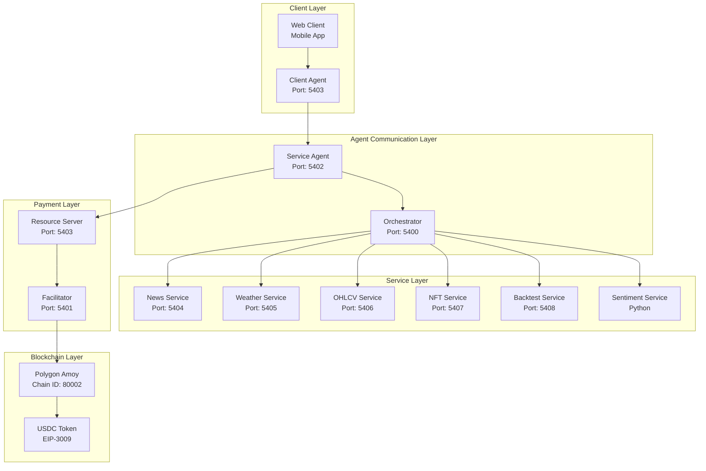
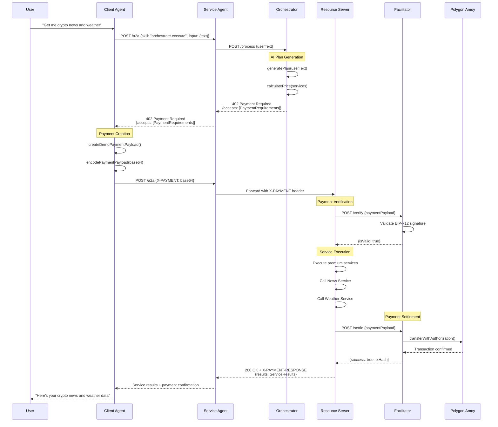

# 🚀 x402 Protocol: Complete Architecture & Framework Guide

> **Revolutionary HTTP-native payment protocol enabling seamless digital payments with blockchain settlement**

[](https://x402.org)
[](https://polygon.technology)
[](https://eips.ethereum.org/EIPS/eip-3009)
[](https://innovationlab.fetch.ai)

---

## 📋 Table of Contents

- [🎯 Overview](#-overview)
- [🏗️ Architecture](#️-architecture)
- [🔄 Protocol Flow](#-protocol-flow)
- [🛠️ Technical Implementation](#️-technical-implementation)
- [🚀 Service Ecosystem](#-service-ecosystem)
- [💡 Key Features](#-key-features)
- [🔧 Development Guide](#-development-guide)
- [📊 Monitoring & Observability](#-monitoring--observability)
- [🔮 Future Roadmap](#-future-roadmap)
- [📚 Resources](#-resources)

---

## 🎯 Overview

The **x402 Protocol** is a groundbreaking **HTTP-native payment standard** that transforms how digital payments work on the internet. By leveraging the existing `402 Payment Required` HTTP status code, it enables seamless integration of blockchain payments into traditional web services.

### **Core Philosophy**
> *"1 line of code to accept digital dollars. No fee, 2 second settlement, $0.001 minimum payment."*

### **What Makes x402 Special?**

- **🌐 HTTP Native**: Works seamlessly with existing web infrastructure
- **⚡ Instant Settlement**: 2-second payment confirmation
- **💰 Micro-payments**: $0.001 minimum payment threshold
- **🔒 Secure**: EIP-712 cryptographic signatures
- **🌍 Chain Agnostic**: Supports multiple blockchains
- **🤖 Agent Ready**: Built for AI agents and autonomous systems

---

## 🏗️ Architecture

### **System Components**



### **Service Portfolio**

| Service | Port | Description | Capabilities |
|---------|------|-------------|--------------|
| **🎯 Orchestrator** | 5400 | Central coordinator | AI planning, pricing, execution |
| **🔐 Facilitator** | 5401 | Payment processor | Verification, settlement, blockchain |
| **⚡ Service Agent** | 5402 | A2A communication hub | JSON-RPC, message routing |
| **📱 Client Agent** | 5403 | Payment-enabled client | EIP-712 signing, retry logic |
| **📰 News Service** | 5404 | Crypto news aggregation | Sentiment analysis, filtering |
| **🌤️ Weather Service** | 5405 | Weather data provider | City forecasts, real-time data |
| **📊 OHLCV Service** | 5406 | Market data service | Price history, technical analysis |
| **🎨 NFT Service** | 5407 | NFT analysis platform | Rarity scoring, trait analysis |
| **📈 Backtest Service** | 5408 | Trading strategy tester | Performance metrics, risk analysis |

---

## 🔄 Protocol Flow

### **Complete Payment Journey**



### **Payment Protocol Phases**

#### **Phase 1: Discovery & Challenge**
1. **Client Request**: User initiates service request
2. **Service Discovery**: Orchestrator analyzes request and generates plan
3. **Payment Requirements**: System returns 402 with payment details
4. **Client Preparation**: Client prepares payment payload

#### **Phase 2: Payment & Settlement**
1. **Payment Creation**: Client creates EIP-712 signed payment
2. **Payment Verification**: Facilitator validates signature and nonce
3. **Service Execution**: Resource server executes premium services
4. **Payment Settlement**: Facilitator broadcasts blockchain transaction
5. **Confirmation**: Client receives results and payment confirmation

---

## 🛠️ Technical Implementation

### **Payment Requirements Schema**

```typescript
interface PaymentRequirements {
  scheme: "exact"                    // Payment scheme type
  network: "polygon-amoy"            // Blockchain network
  maxAmountRequired: string          // Amount in atomic units (6 decimals)
  resource: string                   // Protected endpoint URL
  description: string                // Human-readable description
  mimeType: "application/json"      // Response content type
  payTo: string                     // Recipient wallet address
  maxTimeoutSeconds: number         // Request timeout (seconds)
  asset: string                     // ERC-20 token contract address
  extra: {                          // Scheme-specific metadata
    name: "USDC"                    // Token name
    version: "2"                    // Token version
  }
}
```

### **Agent Communication Protocol**

```typescript
// JSON-RPC 2.0 Message Format
interface A2AMessage {
  jsonrpc: "2.0"
  id: number
  method: "message/send"
  params: {
    skill: string                    // Service identifier
    input: any                       // Request payload
  }
}
```

### **Service Skills Registry**

| Skill | Description | Input Schema | Output Schema |
|-------|-------------|--------------|---------------|
| `premium.summarize` | AI content summarization | `{text: string}` | `{summary: string}` |
| `orchestrate.execute` | Multi-service execution | `{text: string}` | `{results: ServiceResult[]}` |
| `news.fetch` | Cryptocurrency news | `{assets: string[]}` | `{articles: Article[]}` |
| `weather.get` | Weather information | `{city: string}` | `{forecast: WeatherData}` |
| `ohlcv.query` | Price data | `{symbol: string, timeframe: string}` | `{data: OHLCVData[]}` |
| `nft.analyze` | NFT rarity analysis | `{contract: string, tokenId: string}` | `{rarity: number, traits: Trait[]}` |
| `backtest.run` | Strategy backtesting | `{strategy: Strategy}` | `{metrics: BacktestResult}` |

---

## 🚀 Service Ecosystem

### **Orchestrator Service** 🎯
- **Purpose**: Central coordinator for complex multi-service requests
- **Capabilities**:
  - **AI-Powered Planning**: Gemini AI for natural language understanding
  - **Service Discovery**: Automatic service identification and routing
  - **Dynamic Pricing**: Intelligent pricing with bundling discounts
  - **Execution Coordination**: Parallel service execution and result aggregation

### **Facilitator Service** 🔐
- **Purpose**: Secure payment verification and blockchain settlement
- **Capabilities**:
  - **EIP-712 Validation**: Cryptographic signature verification
  - **EIP-3009 Settlement**: Secure token transfers with authorization
  - **Transaction Broadcasting**: Reliable blockchain transaction submission
  - **Multi-chain Support**: Extensible to multiple blockchain networks

### **Specialized Services** 🔧
- **News Service**: Real-time cryptocurrency news with sentiment analysis
- **Weather Service**: Global weather data and forecasting
- **OHLCV Service**: Historical and real-time market data
- **NFT Service**: Advanced NFT analysis and rarity scoring
- **Backtest Service**: Comprehensive trading strategy testing

---

## 💡 Key Features

### **🔒 Security & Trust**
- **Cryptographic Signatures**: EIP-712 typed data for secure payments
- **Nonce Management**: Prevents replay attacks and double-spending
- **Timeout Protection**: Configurable request timeouts
- **Multi-layer Validation**: Signature, nonce, and amount verification

### **⚡ Performance & Scalability**
- **Parallel Execution**: Services run concurrently for optimal performance
- **Intelligent Caching**: Optimized data retrieval and storage
- **Bundling Discounts**: Cost optimization for multi-service requests
- **Fast Settlement**: 2-second payment confirmation on Polygon

### **🌐 Interoperability**
- **HTTP Native**: Seamless integration with existing web infrastructure
- **Chain Agnostic**: Support for multiple blockchain networks
- **Token Agnostic**: Any ERC-20 compatible token
- **RESTful APIs**: Standard HTTP endpoints and responses

### **🎯 User Experience**
- **One-Line Integration**: Minimal code required for implementation
- **Automatic Retry**: Smart payment retry logic with exponential backoff
- **Comprehensive Error Handling**: Detailed error responses and recovery
- **Real-time Feedback**: Live payment status and progress updates

---

## 🔧 Development Guide

### **Quick Start**

```bash
# 1. Clone and Setup
git clone https://github.com/coinbase/x402.git
cd x402

# 2. Environment Configuration
cp demo/.env.example demo/.env.local
# Configure testnet keys, RPC endpoints, and API keys

# 3. Install Dependencies
pnpm install

# 4. Start All Services
bash demo/scripts/start-all.sh

# 5. Monitor Logs
tail -f /tmp/client.log
tail -f /tmp/facilitator.log
tail -f /tmp/resource.log
tail -f /tmp/service.log
```

### **Service Development**

```bash
# Individual Service Testing
cd demo/a2a/services/sentiment
python sentiment.py

# Integration Testing
bash demo/test-simple.sh
bash demo/test-orchestrator.sh

# Full Demo
bash demo/real-x402-demo.sh
```

### **Adding New Services**

1. **Create Service Directory**
   ```bash
   mkdir demo/a2a/services/my-service
   cd demo/a2a/services/my-service
   ```

2. **Implement Payment-Gated Endpoint**
   ```typescript
   app.post('/my-service', async (req, res) => {
     const paymentHeader = req.headers['x-payment'];
     
     if (!paymentHeader) {
       return res.status(402).json({ accepts: [paymentRequirements] });
     }
     
     // Verify payment, execute service, settle payment
   });
   ```

3. **Register with Orchestrator**
   ```typescript
   const SERVICE_ENDPOINTS = {
     'my-service': 'http://localhost:5409/my-service'
   };
   ```

4. **Update Documentation**

---

## 📊 Monitoring & Observability

### **Health Monitoring**

| Component | Health Endpoint | Status Information |
|-----------|----------------|-------------------|
| **Orchestrator** | `GET /healthz` | Service status, dependencies, available services |
| **Facilitator** | `GET /supported` | Supported schemes, networks, capabilities |
| **Services** | Individual endpoints | Service-specific health metrics |

### **Logging & Tracing**

- **Structured Logging**: JSON format for easy parsing and analysis
- **Request Tracing**: End-to-end request tracking with unique IDs
- **Payment Events**: Complete transaction lifecycle logging
- **Error Tracking**: Comprehensive error reporting and categorization

### **Performance Metrics**

- **Payment Success Rate**: Transaction completion and failure rates
- **Service Response Time**: Average and P95 response times
- **Error Rates**: Service reliability and error frequency
- **Usage Patterns**: Service utilization and user behavior analytics

---

## 🔮 Future Roadmap

### **Phase 1: Core Protocol** ✅
- [x] HTTP 402 payment challenges
- [x] EIP-3009 payment settlement
- [x] Agent-to-agent communication
- [x] Multi-service orchestration
- [x] Polygon Amoy integration

### **Phase 2: Ecosystem Expansion** 🚧
- [ ] Additional blockchain networks (Ethereum, Base, Arbitrum)
- [ ] More payment schemes (upto, subscription, streaming)
- [ ] Enhanced service discovery and registry
- [ ] Mobile SDK and React Native integration
- [ ] Web3 wallet integration

### **Phase 3: Advanced Features** 📋
- [ ] Cross-chain payments and bridges
- [ ] Subscription billing and recurring payments
- [ ] Dynamic pricing based on demand and usage
- [ ] AI-powered service optimization and recommendations
- [ ] Decentralized service marketplace

### **Phase 4: Enterprise Features** 🏢
- [ ] Enterprise-grade security and compliance
- [ ] Advanced analytics and reporting
- [ ] Custom payment schemes and workflows
- [ ] Multi-tenant architecture support
- [ ] SLA guarantees and service level agreements

---

## 📚 Resources

### **Documentation**
- **Protocol Specification**: [x402.org](https://x402.org)
- **Technical Architecture**: `ARCHITECTURE.md`
- **Visual Flowcharts**: `FLOWCHARTS.md`
- **API Reference**: `typescript/packages/x402/README.md`

### **Examples & Tutorials**
- **Basic Examples**: `examples/typescript/`
- **Full Demo**: `demo/a2a/`
- **Integration Guides**: `examples/typescript/mcp-embedded-wallet/`

### **Community & Support**
- **Discord Community**: [Join our Discord](https://discord.gg/x402)
- **GitHub Issues**: [Report bugs and request features](https://github.com/coinbase/x402/issues)
- **Contributing Guide**: `CONTRIBUTING.md`
- **Security Policy**: `SECURITY.md`

### **External Resources**
- [EIP-3009: Transfer With Authorization](https://eips.ethereum.org/EIPS/eip-3009)
- [EIP-712: Typed Structured Data](https://eips.ethereum.org/EIPS/eip-712)
- [Polygon Amoy Testnet](https://docs.polygon.technology/docs/develop/network-details/amoy/)
- [Fetch.ai uAgents Framework](https://innovationlab.fetch.ai/resources/docs/agent-communication/uagent-uagent-communication)

---

## 🤝 Contributing

We welcome contributions from the community! Here's how you can help:

### **Ways to Contribute**
- **🐛 Bug Reports**: Help us identify and fix issues
- **✨ Feature Requests**: Suggest new capabilities and improvements
- **📝 Documentation**: Improve guides, tutorials, and specifications
- **🔧 Code Contributions**: Add new services, payment schemes, or features
- **🧪 Testing**: Help us test across different environments and use cases

### **Getting Started**
1. Fork the repository
2. Create a feature branch
3. Make your changes
4. Add tests and documentation
5. Submit a pull request

### **Development Guidelines**
- Follow the existing code style and patterns
- Add comprehensive tests for new features
- Update documentation for any API changes
- Ensure all tests pass before submitting

---

## 📄 License

This project is licensed under the MIT License - see the [LICENSE.md](LICENSE.md) file for details.

---

## 🙏 Acknowledgments

- **Coinbase**: For pioneering the x402 protocol
- **Polygon**: For providing the Amoy testnet infrastructure
- **Fetch.ai**: For the uAgents framework inspiration
- **Community**: For contributions, feedback, and support

---

*Built with ❤️ by the x402 Protocol team*

**Ready to revolutionize payments on the internet?** [Get started now!](https://x402.org)
