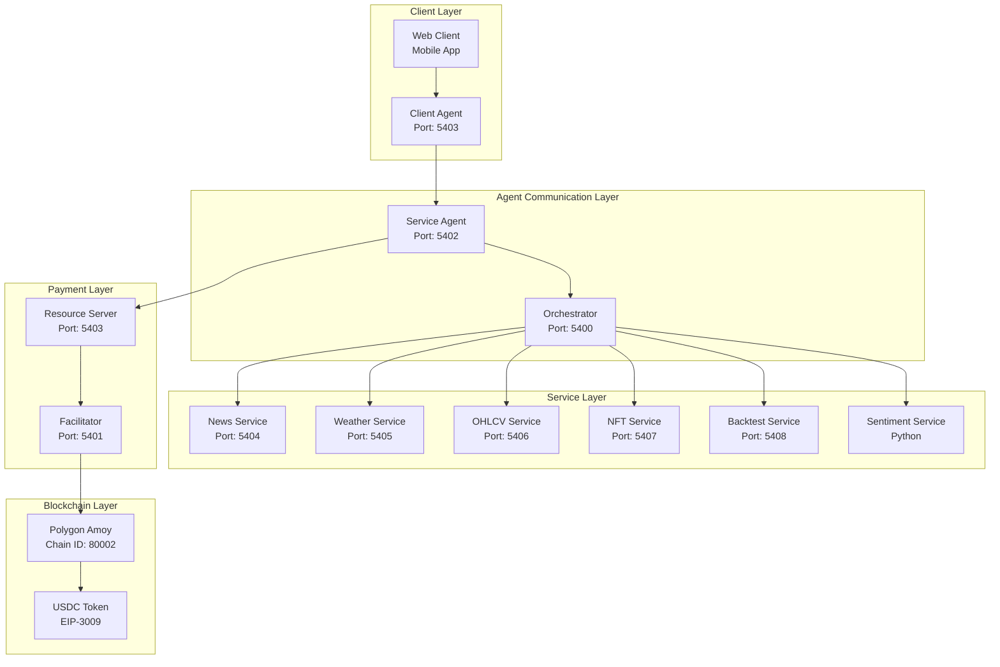
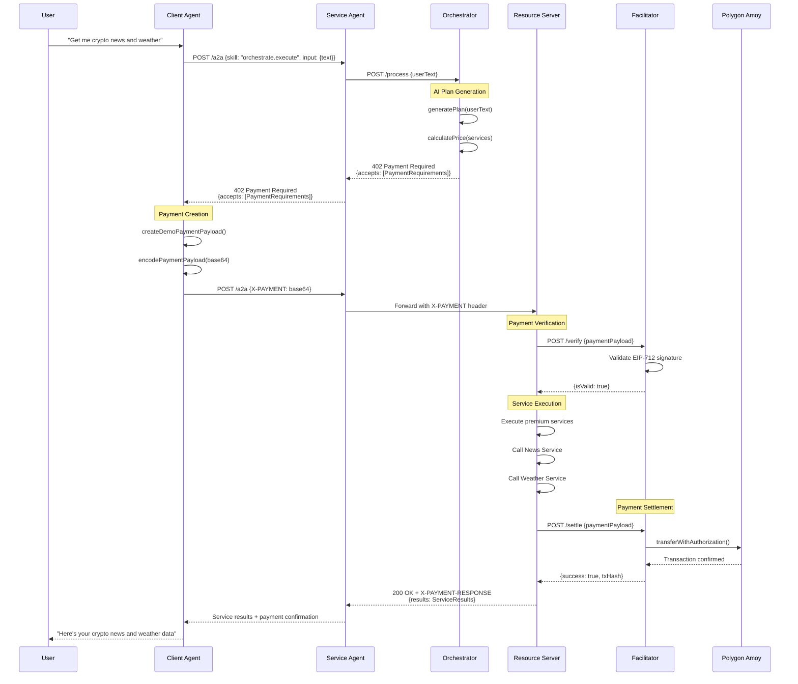
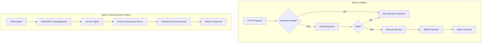
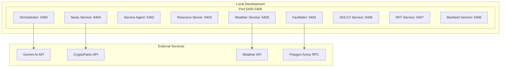
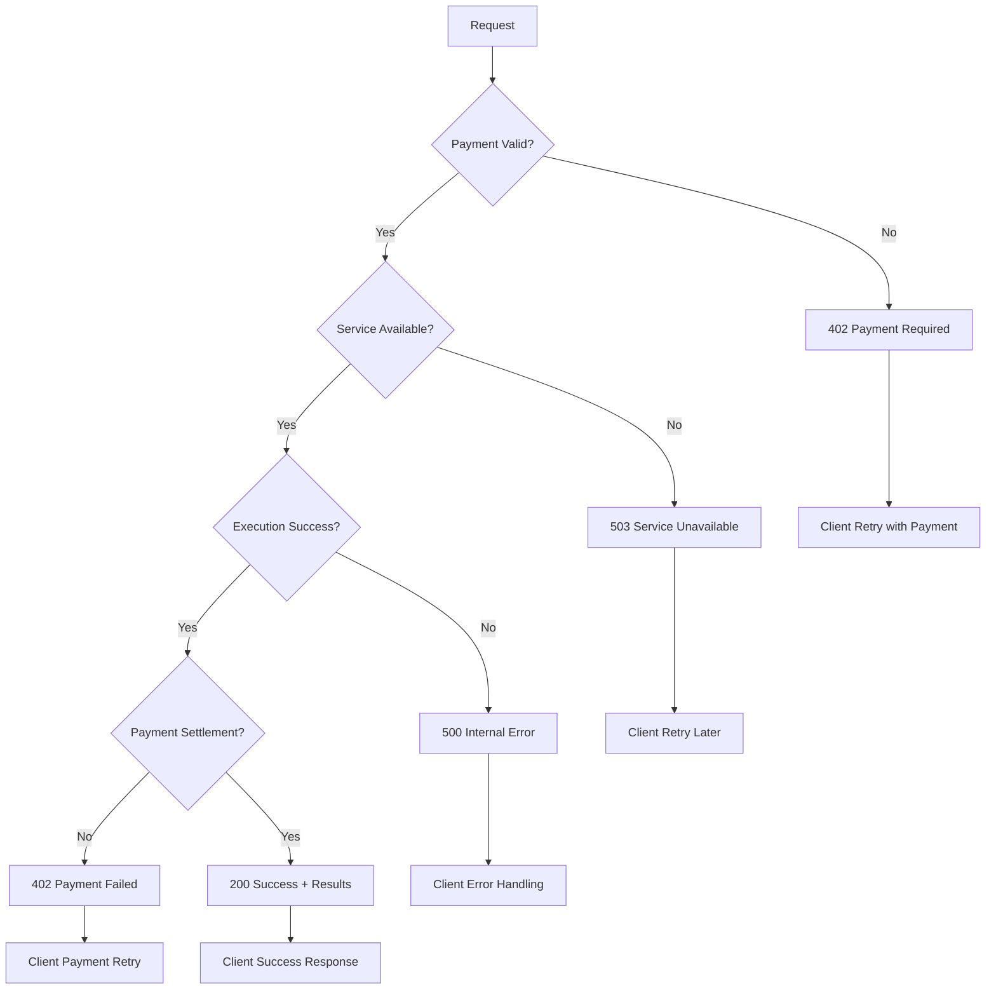
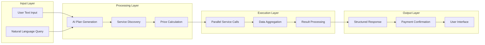

# x402 Protocol Flowcharts

## 🏗️ System Architecture Overview



## 🔄 Complete Payment Flow



## 🎯 Service Discovery & Orchestration

```mermaid
graph TD
    A[User Input: "Get me BTC news and London weather"] --> B[Orchestrator: Text Analysis]
    B --> C{Gemini AI<br/>Plan Generation}
    C --> D[Service Plan:<br/>- news: BTC articles<br/>- weather: London forecast]
    D --> E[Price Calculation:<br/>- Single service: 1000 units<br/>- Bundle discount: 1800 units]
    E --> F[Payment Requirements:<br/>- scheme: exact<br/>- network: polygon-amoy<br/>- amount: 1800 USDC]
    F --> G[402 Response to Client]
    G --> H[Client Creates Payment]
    H --> I[Services Execute in Parallel]
    I --> J[Results Aggregated]
    J --> K[Payment Settled on Blockchain]
    K --> L[Response to User]
```

## 💰 Payment Protocol Details

```mermaid
graph LR
    subgraph "Payment Creation"
        A[Client Request] --> B[402 Response]
        B --> C[PaymentRequirements]
        C --> D[EIP-712 Signature]
        D --> E[Base64 Encoding]
        E --> F[X-PAYMENT Header]
    end
    
    subgraph "Payment Verification"
        F --> G[Resource Server]
        G --> H[Facilitator /verify]
        H --> I[Signature Validation]
        I --> J[Nonce Check]
        J --> K[Amount Verification]
        K --> L[Valid Payment]
    end
    
    subgraph "Payment Settlement"
        L --> M[Service Execution]
        M --> N[Facilitator /settle]
        N --> O[transferWithAuthorization]
        O --> P[Blockchain Transaction]
        P --> Q[Confirmation]
        Q --> R[X-PAYMENT-RESPONSE]
    end
```



## 🔧 Service Architecture Patterns



## 🌐 Network Topology



## 🔄 Error Handling Flow



## 📊 Data Flow Architecture



---

## 🎨 Visual Legend

| Symbol | Meaning |
|--------|---------|
| 🔵 **Blue Circles** | Core Services |
| 🟢 **Green Rectangles** | External APIs |
| 🟡 **Yellow Diamonds** | Decision Points |
| 🔴 **Red Hexagons** | Error States |
| ⚪ **White Ovals** | Data/Results |
| 🔗 **Arrows** | Data Flow |
| 📦 **Boxes** | Service Groups |

---

*These flowcharts provide a comprehensive visual representation of the x402 protocol architecture, payment flows, and service interactions.*
